# [tech-spec] YAML Contract Support for test-contractor

* 1 [Infrastructure](#Infrastructure)
  * 1.1 [test-contractor](#test-contractor)
* 2 [Model](#Model)
  * 2.1 [test-contractor](#test-contractor)
    * 2.1.1 [YamlContractDefinition](#YamlContractDefinition)
    * 2.1.2 [YamlMethodDefinition](#YamlMethodDefinition)
    * 2.1.3 [YamlTerm](#YamlTerm)
    * 2.1.4 [YamlCustomTypes](#YamlCustomTypes)
* 3 [Component Architecture](#Component-Architecture)
  * 3.1 [YAML Parser Module](#YAML-Parser-Module)
* 4 [Flow](#Flow)
  * 4.1 [Backend](#Backend)
    * 4.1.1 [YAML Parsing Flow](#YAML-Parsing-Flow)
    * 4.1.2 [Contract Loading Flow](#Contract-Loading-Flow)
    * 4.1.3 [Contract Test Execution Flow](#Contract-Test-Execution-Flow)
* 5 [API Interfaces](#API-Interfaces)
* 6 [Happy Path](#Happy-Path)
* 7 [Backwards Compatibility](#Backwards-Compatibility)

# Infrastructure

## test-contractor

New YAML-based contract definition system supporting `*.contract.yaml` files alongside existing `*.contract.ts` files.

**New exports:**
* `YamlContractParser.parseFile(path: string): Promise<YamlContractDefinition>` - Parse YAML contract file
* `YamlContractParser.parseString(yaml: string): YamlContractDefinition` - Parse YAML contract string
* `loadYamlContract(path: string): Promise<Contract>` - Load YAML contract and resolve module
* `yamlContractFactory(definition: YamlContractDefinition, modulePath: string): Contract` - Create contract from YAML definition

**Modified exports:**
* `contractorTestRunner.dir(dirLocation: string)` - Now discovers both `*.contract.ts` and `*.contract.yaml` files
* `contractorTestRunner._file(fileLocation: string)` - Routes TS and YAML files to appropriate loaders

**New dependency:**
* `js-yaml` - YAML parsing with custom type support

# Model

## test-contractor

### YamlContractDefinition

Top-level contract structure parsed from YAML file.

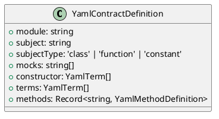

### YamlMethodDefinition

Method definition with terms, mocks, and setup.

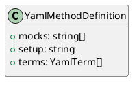

### YamlTerm

Single test term with params and result, supporting shorthand string format.

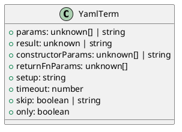

### YamlCustomTypes

Custom YAML types for JavaScript objects using js-yaml Type system.

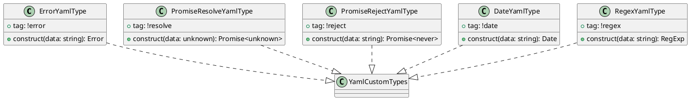

### Shorthand Format

Shorthand string format for quick term definitions:
* Basic: `[params] => result`
* With constructor: `([ctorParams]); [params] => result`

# Component Architecture

## YAML Parser Module

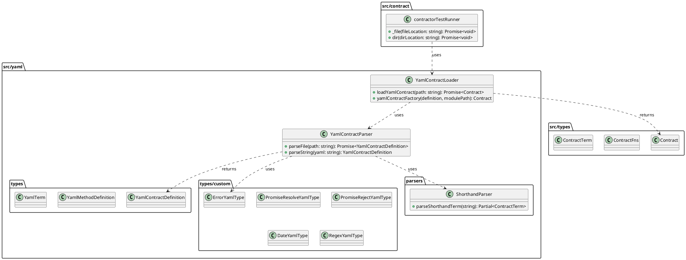

# Flow

## Backend

### YAML Parsing Flow

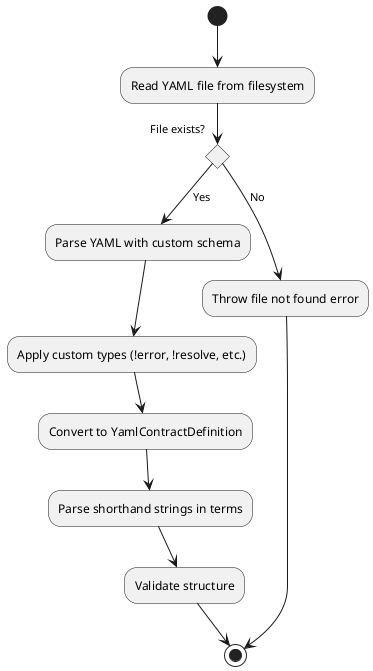

### Contract Loading Flow

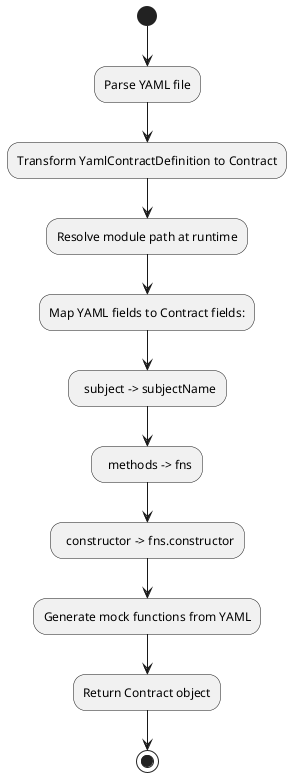

### Contract Test Execution Flow

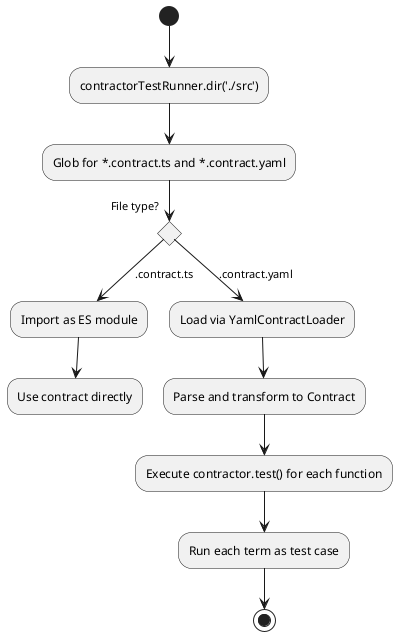

# API Interfaces

## YamlContractParser

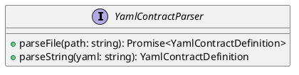

**Methods:**
* `parseFile(path: string)` - Reads and parses YAML file from filesystem, returns contract definition with custom types applied
* `parseString(yaml: string)` - Parses YAML string content, returns contract definition

## YamlContractLoader

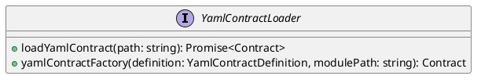

**Methods:**
* `loadYamlContract(path: string)` - Loads YAML contract file, resolves module, returns compatible Contract object
* `yamlContractFactory(definition, modulePath)` - Transforms YAML definition to Contract, handles field mapping and mock generation

## ShorthandParser

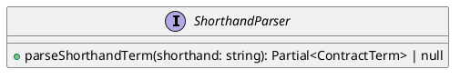

**Methods:**
* `parseShorthandTerm(shorthand: string)` - Parses shorthand format string, returns partial ContractTerm or null if invalid

**Shorthand patterns:**
* Basic: `/^\[([^\]]*)\]\s*=>\s*(.+)$/`
* With constructor: `/^\(([^)]*)\);\s*\[([^\]]*)\]\s*=>\s*(.+)$/`

# Happy Path

1. Developer creates `user-service.contract.yaml` with method definitions and test terms
2. Test runner discovers `*.contract.yaml` files via glob pattern
3. `YamlContractLoader` loads and parses the YAML file
4. Custom YAML types (`!error`, `!resolve`, `!reject`) create real JavaScript objects
5. Shorthand strings are converted to structured terms
6. YAML fields are mapped to existing Contract structure
7. Module is resolved at runtime via dynamic import
8. Contract tests execute using existing `contractor()` function
9. Tests pass with same behavior as TS contracts

# Backwards Compatibility

Existing `*.contract.ts` files continue to work without modification. The test runner detects file extension and routes accordingly:
* `.contract.ts` -> Direct ES module import
* `.contract.yaml` -> YAML loader and transformation

Both formats can coexist in the same project during migration period.

---

## Critical Files for Implementation

| File | Purpose |
|------|---------|
| `src/yaml/yaml-contract-parser.ts` | Core YAML parsing logic with custom schema |
| `src/yaml/yaml-contract-loader.ts` | Contract loading and module resolution |
| `src/contract/contractor-test-runner.ts` | Test runner updates for YAML discovery |
| `src/types/index.ts` | Core contract types (reference for compatibility) |
| `src/yaml/types/yaml-contract-types.ts` | YAML contract type definitions |

---

## New Module Structure

```
src/yaml/
├── index.ts                      # Main export
├── yaml-contract-parser.ts       # YAML parsing service
├── yaml-contract-loader.ts       # Contract loading and transformation
├── types/
│   ├── index.ts                  # Type exports
│   ├── yaml-contract-types.ts    # YamlContractDefinition, YamlTerm, etc.
│   └── custom/
│       ├── index.ts              # Custom type exports and schema
│       ├── error-type.ts         # !error tag
│       ├── promise-type.ts       # !resolve and !reject tags
│       ├── date-type.ts          # !date tag
│       └── regex-type.ts         # !regex tag
└── parsers/
    ├── index.ts                  # Parser exports
    └── shorthand-parser.ts       # Shorthand string parser
```

---

## Example YAML Contract

```yaml
# user-service.contract.yaml
$schema: https://example.com/schemas/contract-v1.json
module: ./services/user-service
subject: UserService
subjectType: class

mocks:
  - ./repositories/user-repo.contract.yaml

constructor:
  - params:
      - db: mock-db
        logger: mock-logger
    result: {}

methods:
  findById:
    terms:
      - params: [1]
        result:
          id: 1
          name: John
          email: john@example.com
      - params: [999]
        result: null
      - params: [-1]
        result: !error "Invalid ID"

  create:
    terms:
      - params:
          - name: John
            email: john@example.com
        result:
          id: 1
          name: John
          created: true
      - params:
          - name: ""
        result: !error "Name required"
```
